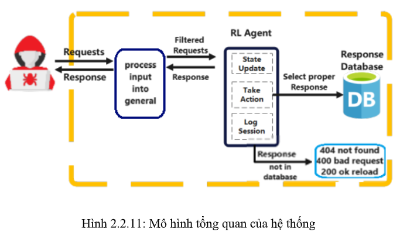

# Adaptive High-Interaction Honeypot for Web Deception Leveraging Reinforcement Learning

**Giảng viên hướng dẫn:** ThS. Đỗ Hoàng Hiển  
**Sinh viên thực hiện:**  
- Nguyễn Hoàng Phúc - 20520277  
- Võ Thành Tín - 20522019

## I. Giới thiệu

### 1. Mục tiêu đồ án
Tạo ra một Honeypot thích ứng để đánh lừa kẻ tấn công trên nền tảng web sử dụng phương pháp học tăng cường. Với các kỹ thuật học tăng cường, Honeypot sẽ đưa ra các phản hồi chính xác khi tương tác với kẻ tấn công, từ đó thu hút kẻ tấn công tiếp tục thực hiện khai thác các lỗ hổng và upload malware lên web.

### 2. Tính năng chính
- Honeypot đưa ra các phản hồi chính xác khi attacker thực hiện khai thác các lỗ hổng web.

### 3. Công nghệ sử dụng
- **Thuật toán học tăng cường:** PPO, Q-learning
- **Model:** MLP
- **Thư viện:** OpenAI Gym, Stable Baselines3, NLP
- **Code platform:** Anaconda - Jupyter Notebook

### 4. Mô hình và cách hoạt động

1. Input là các chuỗi truy vấn GET/POST của attacker khi thực hiện tấn công web.
2. Attacker thực hiện một lệnh request để khai thác lỗ hổng trên web.
3. Lệnh request này được xử lý để đưa về dạng tổng quát và sau đó gửi đến RL-Agent.
4. RL-Agent kiểm tra xem dạng tổng quát đó có nằm trong database không:
   - Nếu có, RL-Agent chọn các phản hồi hợp lý (sau khi đã được train) khớp với request để phản hồi lại cho attacker.
   - Nếu không, RL-Agent chọn các phản hồi không nằm trong database (các trường hợp đặc biệt) để phản hồi lại cho attacker.

## II. Demo

